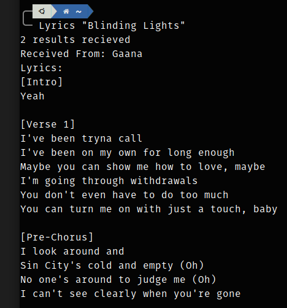

# Terminal Based Lyrics Finder
Your favourite song 🎵 comes up when you are coding and you want to sing along 	:star_struck:?
Want to take a break from coding and enjoy your favourite music 🎵?

Can't remember the lyrics :grimacing: and too lazy 😪 to search the net. I got you covered. 	:grin:

Use this terminal based lyrics finder to get your favourite lyrics to the terminal :heart_eyes:. 

## Prerequistes
- Scrapy
  ` python3 -m pip install scrapy`

## How to run
### Method 1
1. Clone this repo and install scrapy
2. Run `python3 main.py -s "<song_name>" -a "<singer_name>"`
3. Fill in the required song name and singer name (optional) in the above command and see its lyrics in the terminal in no time. 

### Method 2: Run from anywhere
1. Clone the repo and install scrapy
2. Add `alias Lyrics="<path/to/repo>/LyricsFinder/Lyrics"` to bashrc or zshrc
3. Also edit the [Lyrics File](Lyrics) file by adding path to repo 
4. Run `Lyrics "<song_name>" "<singer_name>"` from any terminal to get the lyrics in no time.

## How this works?
I use scrapy a web scraping tool to search google with the lyrics and singer name you entered. I have written web scraping code to get lyrics from a number of websites. I search through the search results of google for those websites and jump to them, scrape the lyrics and print it neatly on the terminal. 

This is how it looks finally. 

